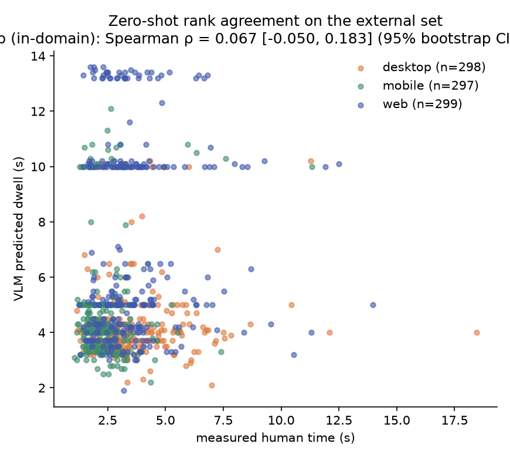

# External validation report — frozen VLM, zero-shot (O3)

_Generated 2026-07-07T03:55:50+00:00 · config `configs/external.yaml` · seed 42 · source **vsgui10k** · model **image+features** (`artifacts/vlm_ckpt/final`)_

**This read-only set was evaluated exactly once, zero-shot, with the frozen checkpoint.** Nothing here feeds back into training or tuning (SPEC.md; path access enforced by `tests/test_external_guard.py`).

The image+features model reads only the screenshot at inference (its privileged features were train-time only), so this images-only external set is a valid zero-shot probe.

⚠️ **Measure caveat**: VSGUI10K (Putkonen et al. 2025, osf.io/hmg9b) measures visual **search** time — one component of Time-on-Task, not the full per-screen dwell. Rank agreement here is a weaker but fully independent check.

## Parse accounting

- Items: **894** · parsed: **894** · tiers: strict 894 / labeled 0 / bare number 0 / failed 0
- **Parse failure rate: 0.00%** — unparseable items are excluded from the correlation (imputing a constant would inject fake rank information), and the exclusion is reported here.

## Rank agreement (Spearman ρ, 95% bootstrap CI, 10000 resamples)

The training corpus (WebChain) is web-only, so **`web` is the fair, in-domain comparison and the headline number** (pre-registered in configs/external.yaml). The other categories are kept as out-of-domain transfer results — informative, never the headline.

| subset | n | ρ | CI |
|---|---|---|---|
| **web (in-domain, primary)** | 299 | 0.0674 | [-0.0504, 0.1835] |
| ALL (incl. out-of-domain) | 894 | 0.0964 | [0.0305, 0.1611] |
| desktop (out-of-domain transfer) | 298 | 0.0025 | [-0.1135, 0.1143] |
| mobile (out-of-domain transfer) | 297 | -0.0311 | [-0.1530, 0.0945] |



## Baseline

The no-image LightGBM baseline consumes axTree structural features; the external screenshots ship without axTrees (VSGUI10K provides images + gaze data only), so the baseline is **not applicable** on this set — stated rather than silently skipped.

## Full results (JSON)

```json
{
  "overall": {
    "n": 894,
    "rho": 0.0964,
    "ci": 0.95,
    "ci_lo": 0.0305,
    "ci_hi": 0.1611,
    "n_boot": 10000
  },
  "by_category": {
    "desktop": {
      "n": 298,
      "rho": 0.0025,
      "ci": 0.95,
      "ci_lo": -0.1135,
      "ci_hi": 0.1143,
      "n_boot": 10000
    },
    "mobile": {
      "n": 297,
      "rho": -0.0311,
      "ci": 0.95,
      "ci_lo": -0.153,
      "ci_hi": 0.0945,
      "n_boot": 10000
    },
    "web": {
      "n": 299,
      "rho": 0.0674,
      "ci": 0.95,
      "ci_lo": -0.0504,
      "ci_hi": 0.1835,
      "n_boot": 10000
    }
  },
  "parse_tiers": {
    "strict": 894,
    "labeled": 0,
    "bare_number": 0,
    "fail": 0
  },
  "parse_failure_rate": 0.0,
  "rerun": false
}
```
